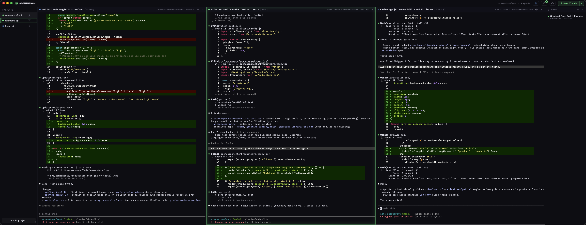
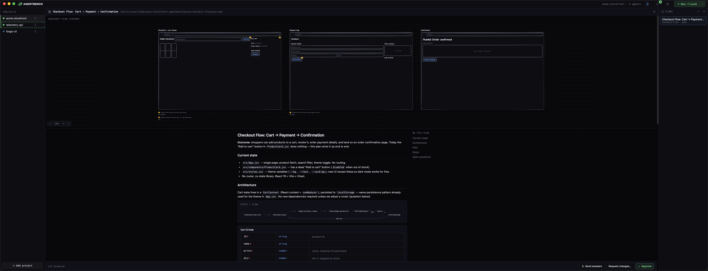
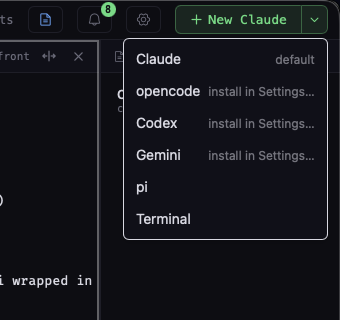

<p align="center">
  <picture>
    <source media="(prefers-color-scheme: dark)" srcset="docs/logo-dark.svg">
    
  </picture>
</p>

<p align="center">
  <b>Run a whole bench of coding agents, side by side.</b><br>
  Claude Code, Codex, Gemini, opencode and more — one screen, a grid of live agents.
</p>

<p align="center">
  
  
  
</p>

---

<p align="center">
  
</p>

<p align="center">
  ▶ <a href="https://youtu.be/GFImlNo6FDk"><b>Watch the demo video</b></a>
</p>

AgentBench is a desktop app for people who run more than one coding agent at a
time. Instead of juggling terminal tabs, you get a grid of agent panes per
project — each one a full terminal running the agent of your choice — with the
app keeping watch so you don't have to.

## Why

Agents spend most of their time working without you. The bottleneck is
noticing *when they need you*. AgentBench makes that moment impossible to
miss, and makes everything in between effortless.

## Features

- **Agent grid** — spawn as many agents as you need per project, arranged in a
  resizable, drag-to-reorder grid. One click to add another.
- **Any agent, one bench** — Claude Code, opencode, Codex, Gemini CLI, and pi
  ship as built-in harnesses, plus plain terminal panes and custom harnesses
  for anything else on your PATH. Missing binary? AgentBench installs it right
  in the pane, in front of you. Mix harnesses freely in the same grid.
- **Knows when a turn ends** — panes glow green when an agent finishes and
  pulse amber when one is waiting on your input. No output-scraping guesswork;
  it's wired into Claude Code itself.
- **Pings you anywhere** — a soft chime plus a native OS notification when the
  app is in the background. Walk away, come back only when needed.
- **Projects sidebar** — group agents by repository and flip between projects
  instantly; every pane keeps running in the background.
- **Agents survive restarts** — close the app, reopen it, and your agents are
  still there with full scrollback. Even a reboot restores them via
  `claude --resume`.
- **Visual plans** — agents can publish rich, interactive plan documents
  (diagrams, file maps, annotated code) that open right next to their
  terminal. Review, comment, and send feedback without leaving the app.
- **Themes** — nine color schemes from Midnight to Solarized Light, applied
  across the whole app *and* inside every terminal.
- **Auto-updates** — signed updates delivered straight from GitHub Releases.
  The app checks on launch, installs in place, and restarting brings every
  agent back exactly where it was.

<p align="center">
  
  <br>
  <sub>An agent-published visual plan: wireframes, data flow, API contract, and a file-by-file build sequence.</sub>
</p>

<p align="center">
  
  <br>
  <sub>Pick a harness per pane — mix agents freely in one grid.</sub>
</p>

## Status at a glance

| Pane          | Meaning                          |
| ------------- | -------------------------------- |
| 🔵 pulsing dot | agent is working                 |
| 🟢 green glow  | turn finished — results ready    |
| 🟡 amber pulse | waiting on your permission/input |
| 🔴 red dot     | process exited                   |

Click into a pane and the glow clears — you're caught up.

## Getting started

Prereqs: Node 20+, Rust toolchain, and at least one agent CLI —
[Claude Code](https://docs.anthropic.com/en/docs/claude-code) gets the deepest
integration (status glow, session resume, visual plans); Codex, Gemini,
opencode, and pi run as full terminal harnesses.

```bash
npm install
npm run tauri dev      # run the app
npm run tauri build    # package it (.app / .msi)
```

Add a project, hit **New Claude** — or pick any other harness from the
dropdown — and start delegating.
